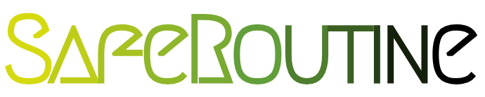
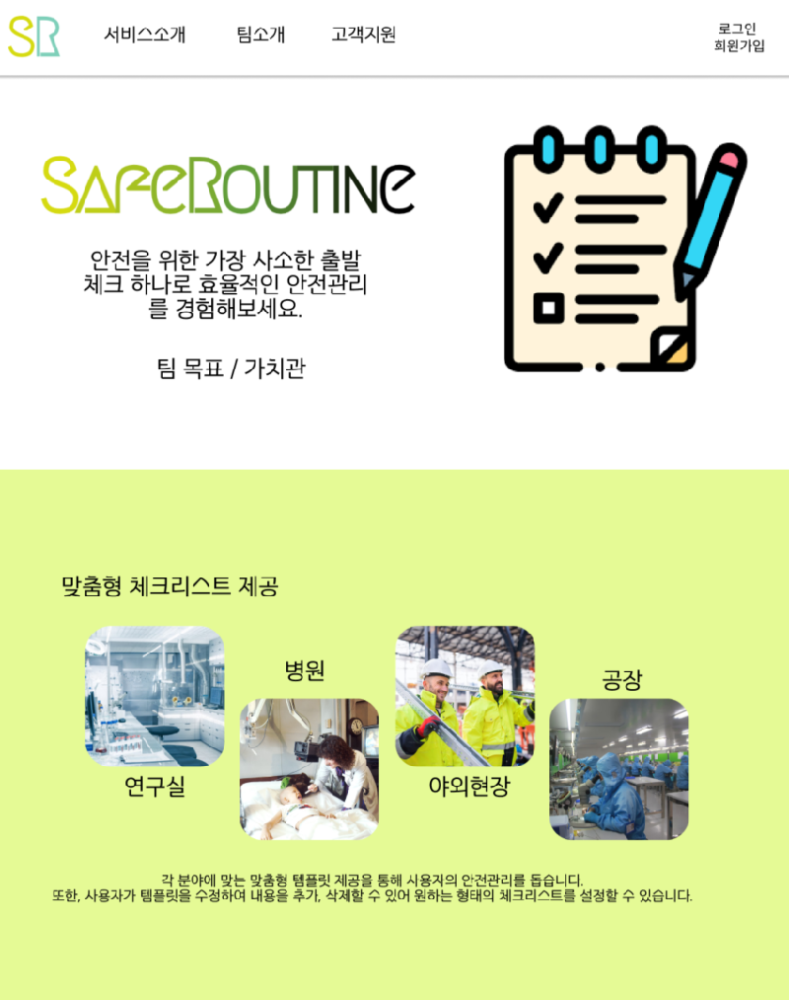
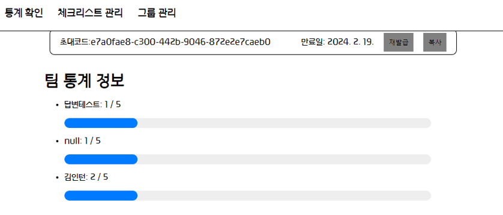
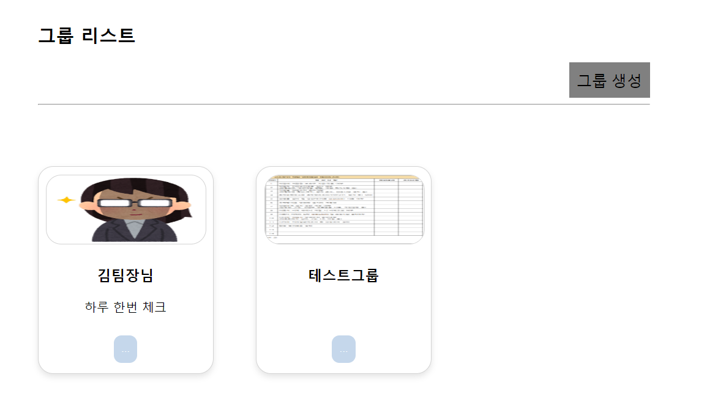
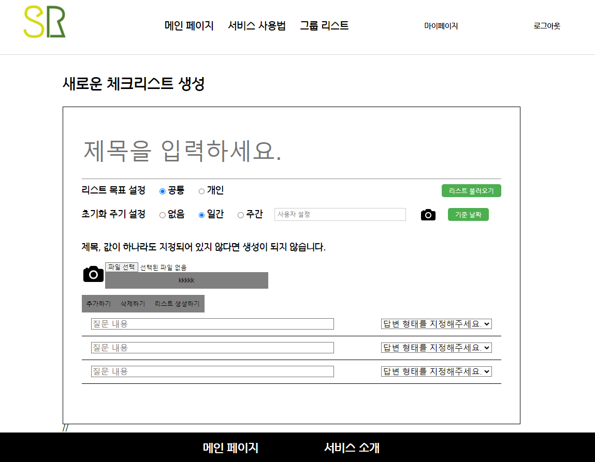

  

  <h1>SAFEROUTINE: 중소규모 시설을 위한 안전관리 웹사이트</h1>

---

## 목차
1. [개요](#개요)
2. [개발 환경](#개발-환경)
3. [서비스 화면](#서비스-화면)
4. [주요 기능](#주요-기능)
5. [기술 소개](#기술-소개)
6. [설계 문서](#설계-문서)
7. [팀원 소개](#팀원-소개)

## 개요

| **서비스명**       | **SAFEROUTINE**                                                    |
|----------------|--------------------------------------------------------------------|
| **개발 의도**      | 안전점검표 관리의 **Digital Transformation**을 통한 혁신적인 서비스 제공               |
| **주요 이용자**     | 기록 관리에 리소스를 줄이고 싶으나, 솔루션 등을 구매하기 곤란한 소규모 업장, 대학원 연구실 등의 관리자 및 이용자 |
| **해결하고 싶은 문제** | 수기 기록들이 아날로그로 쌓여 장부 열람이 어려운 문제 아날로그 기록 조작 방지                    |
| **해결 방법**      | OCR 기능 제공을 통한 기존 장부 자동 갱신, 디지털화   사진 기록을 통한 더욱 정확한 안전 관리        |
| **서비스 가치**     | 관리자의 편의성 상승                                                        |
| **핵심 기능**      | **OCR**을 통한 서류 디지털화, 템플릿 생성                                        |

## 개발 환경

### MANAGEMENT  

### IDE  

### INFRA  

### FRONTEND  

### BACKEND  

### CLOUD  

## 서비스 화면

### 메인 화면

### 팀 관리 화면

### 체크리스트 생성 및 OCR 화면

## 주요 기능

OCR 기능을 사용해 체크리스트 템플릿을 빠르게 생성  

## 기술 소개

- **NAVER CLOVA OCR** : 사진에 있는 글자들을 인식해서 사용할 수 있도록 json으로 반환해주는 API

## 설계 문서

### [API 명세서](https://pinnate-knot-655.notion.site/API-41e23b55e50d4a8bab313226d201b5a8)

### [ERD 링크](https://pinnate-knot-655.notion.site/ERD-1b2ab011ac594153b15289d0ad1fb3ca)

## 팀원 소개

### BackEnd
 - 김진우 : 안전 점검표 API, OCR API  
 - 류진호 : 로그인 API  
 - 최홍준 : 팀 및 팀 맴버 관리 API, 이미지 API

### FrontEnd 
- 강보훈 : 컴포넌트, Axios 및 체크 리스트 페이지  
- 주동현 : 컴포넌트, 팀 관리 페이지  
- 이현정 : CI/CD, 컴포넌트, Axios 및 사용자 페이지